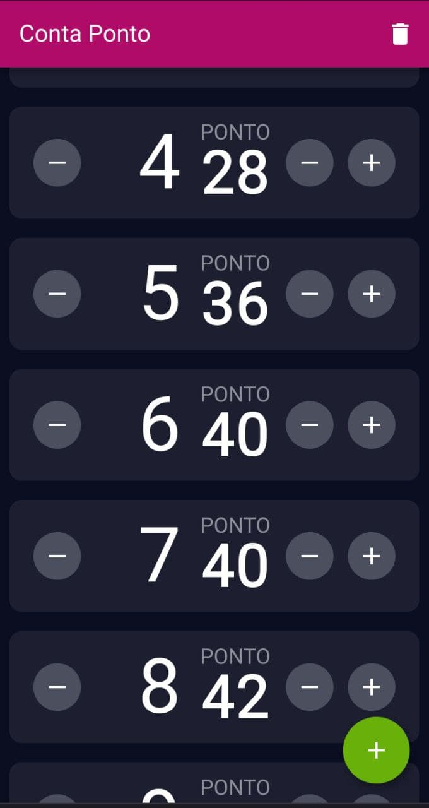

# Conta Ponto

This is an app I made as a tool for my girlfriend. She works with crochets, and as such she could use a counter that can keep track of a number of layers and the knots in each layer. 

It's currently available [here](conta-ponto-crochet.web.app).

You can add new layers or remove an existing one, add or subtract to each counter or set it to a specific number. The data is saved locally on your device.

I made this as a web app, but it can be built as an Android, iOS ow Windows app, thanks to Flutter. However, the configuration files for those platforms aren't included here.

TODO: 

- Implement layout for desktops
