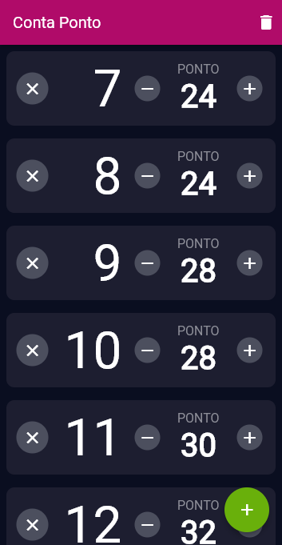

# Conta Ponto

This is an app I made as a tool for my girlfriend. She works with crochets, and as such she could use a counter that can keep track of a number of layers and the knots in each layer. I went ahead and added a couple features that couls save the user some time, but she doesn't seem to care too much.

It's currently available [here](https://conta-ponto-crochet.web.app).

You can add new layers (hold the button to add multiple) or remove an existing one, add or subtract to each counter or set it to a specific number. The data is saved locally on your device.

I made this as a web app, but it can be built as a mobile or desktop app for all platforms, thanks to Flutter. 

TODO: 

- Implement layout for desktops
